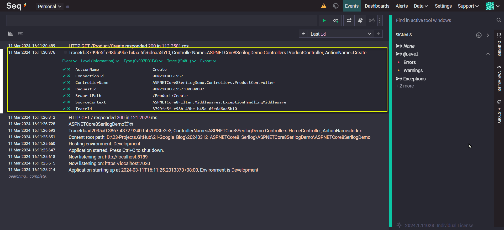

## 如何在 ASP.NET Core 8 MVC 應用程式使用 Serilog 
## How to use Serilog in ASP.NET Core 8 MVC application  

## 前言

筆者在前兩篇有針對 "ASP.NET MVC 及 ASP.NET Core MVC 的錯誤處理" 作了描述. 對於錯誤處理(Error Handling) 作了以下定義: **係指錯誤取得 (Catch), 訊息規格 (Specification), 呈現 (Presentation), 及記錄 (Logging)**.  

前兩篇涵蓋了 "錯誤取得" 及 "訊息規格", 尚餘 "呈現" 及 "記錄".  

#### 呈現 (Presentation):  
需視需求而定. 由於對前端不是很專長, 這裡就先藏拙不表.  

#### 記錄 (Logging): 
本文主要著重於此. 由於很多人推薦 Serilog, 所以, 就以此作為演練的對象. 一般而言, 記錄會包含以下幾個面向:  
* 記錄的層級 (Log Level).  
各個 Log 套件都有其 Log Level 的定義, 但大同小異.  
* 記錄的目標或提供者 (Log Target / Log Provider / Log Sinks).  
例如: Console, File, MSSQL, Seq. 前3者很明確, 不作贅述. 至於 <a href="https://datalust.co/seq" target="_blank">Seq</a> 則是一個集中的 Logging 服務 , 它提供了 Web UI 介面, 可以讓**開發人員**或**系統管理人員**操作, 進行記錄的查詢.  
  * 在 <a href="https://github.com/NLog/NLog.Web" target="_blank">NLog</a> 稱之為 Targets.  
  對於 NLog 有興趣的朋友, 可參考這篇文章 <a href="https://blog.elmah.io/nlog-tutorial-the-essential-guide-for-logging-from-csharp/" target="_blank">NLog Tutorial - The essential guide for logging from C#</a>.  
  * 在 <a href="https://learn.microsoft.com/en-us/aspnet/core/fundamentals/logging/?view=aspnetcore-8.0" target="_blank">ASP.NET Core build-in Logger</a>
  稱之為 <a href="https://learn.microsoft.com/en-us/aspnet/core/fundamentals/logging/?view=aspnetcore-8.0#bilp" target="_blank">Provider</a>.  
  * 在 <a href="https://github.com/serilog/serilog" target="_blank">Serilog</a>
  稱之為 <a href="https://github.com/serilog/serilog/wiki/Provided-Sinks" target="_blank">Sinks </a>. 中文很難翻譯, 查 Google 是水槽, 反正就是一個記錄儲存的地方.  
* 記錄的內容 (Log Content): 
需視需求而定.  

本文將以前述 "ASP.NET Core MVC Error Handling 摘要版" 的程式為基底, 繼續往下增修內容.  

章節內容如下:  

一. [內建 Logger 的功能](#section1)  
二. [加入 Serilog 相關套件](#section2)  
三. [輸出至 Console 及 File 入門](#section3)  
四. [利用 UseSerilogRequestLogging middleware 記錄 Http Request 內容](#section4)  
五. [自訂輸出格式](#section5)  
六. [輸出至 Seq Logging 服務入門](#section6)  
七. [輸出至 MSSQL 資料庫入門](#section7)  
&nbsp;&nbsp;&nbsp;(一) [套件安裝](#section7_1)  
&nbsp;&nbsp;&nbsp;(二) [由 Serilog.Sinks.MSSqlServer 決定預設的欄位及資料型態 (by appsettings.json)](#section7_2)  
&nbsp;&nbsp;&nbsp;(三) [Serilog.Sinks.MSSqlServer 欄位種類概述](#section7_3)  
&nbsp;&nbsp;&nbsp;(四) [自訂 Serilog.Sinks.MSSqlServer 的欄位及資料型態 (by Program.cs)](#section7_4)  
&nbsp;&nbsp;&nbsp;(五) [自訂 Serilog.Sinks.MSSqlServer 的欄位及資料型態 (for ProblemDetails by Program.cs)](#section7_5)  
&nbsp;&nbsp;&nbsp;(六) [改用自定義的統一輸出格式 (MyProblemDetails)](#section7_6)  
&nbsp;&nbsp;&nbsp;(七) [建立一層 LoggingService 打包 ILogger, 以利寫入資料庫欄位](#section7_7)  
八. [關於 Serilog 的增強器 (Enrichers)](#section8)  

目前 GitHub 上的範例版本為最後一版, 請自行下載參考.   

<!--more-->

## 一. 內建 Logger 的功能 <a id="section1"></a>

1.. 記錄的輸出目標或提供者 (Log Target or Log Provider):   
預設會輸出到 Console, 但可以加入 <a href="https://learn.microsoft.com/en-us/aspnet/core/fundamentals/logging/?view=aspnetcore-8.0#bilp" target="_blank">其它輸出</a>, 例如: Debug / Event Log ... 等.  
然而經實測, 那個 AddDebug() 似乎沒什麼作用, 按下 [F5] 進行偵錯, 發現記錄內容, 都不會輸出到 [輸出]視窗的[偵錯]項目. 但一般不會用內建的 Logger, 所以就不深究此問題了.  
```csharp
#region 內建 Logger 的設置
// 不寫以下程式, 預設會輸出到 Console.
// 但修改以下的程式, 可以設定更多的輸出目標. 
builder.Logging.ClearProviders();
builder.Logging.AddConsole();
builder.Logging.AddDebug();
#endregion
```

另外, 若有必要, 也可在 Program.cs 取得 logger 物件之後, 呼叫其方法, 輸出 log.  
```csharp
#region 在 Program.cs 使用 Logger
// 建立 logger
var logger = app.Services.GetRequiredService<ILogger<Program>>();
// 使用 logger
logger.LogInformation("Application starting up at {Time}, Environment is {EnvironmentName}", DateTime.Now, app.Environment.EnvironmentName);
#endregion
```

2.. 記錄類別 (Log Category):  
簡單來說, 就是那個 ILogger<T> 那個 T 的全名, 例如: 以下程式段代表的記錄類別是  ASPNETCore8SerilogDemo.Controllers.HomeController  
```csharp
private readonly ILogger<HomeController> _logger;
```

3.. 記錄層級 (Log Level):  
```ini
Trace = 0, Debug = 1, Information = 2, Warning = 3, Error = 4, Critical = 5, None = 6
```  
以下 appsettings.Development.json 設定檔的內容, 代表:  
(1) 如果是 Microsoft.AspNetCore 的記錄類別, 會將 Warning(含) 層級以上的內容, 送至輸出目標.  
(2) 其它的記輸出 Information(含) 層級以上的內容至輸出目標.  

註: Visual Studio 2022 預設建立的 MVC 專案, 其執行環境為 Development, 所以, 如果在 Visual Studio 2022 執行程式, 要看 appsettings.Development.json 設定檔.  
```json
{
  "Logging": {
    "LogLevel": {
      "Default": "Information",
      "Microsoft.AspNetCore": "Warning"
    }
  },
  "AllowedHosts": "*"
}
```

4.. 實測截圖如下.  


5.. 小結:  
以上針對 "內建 Logger 的功能" 作了粗淺的描述, 其實這個只適於自行演練使用, 若為實務上, 通常要寫到 File 或 DB 作為監控之用.  

## 二. 加入 Serilog 相關套件 <a id="section2"></a>

本段會展示的輸出目標為 Console 及 File.  

1.. 各個 Log 套件都有其 Log Level 的定義, 但大同小異.  

```ini
.NET Core 原生: Trace = 0, Debug = 1, Information = 2, Warning = 3, Error = 4, Critical = 5, None = 6
Serilog:      Verbose = 0, Debug = 1, Information = 2, Warning = 3, Error = 4, Fatal = 5
```

2.. 加入 Serilog.AspNetCore 套件.  
目前安裝的是 8.0.1 版, 它會一併安裝其它相依套件.  
```bash
dotnet add package Serilog.AspNetCore
```

## 三. 輸出至 Console 及 File 入門 <a id="section3"></a>

### (一) 程式碼寫死:  
1.. 設置 Serilog.  
程式碼如下: 
```csharp
using Serilog;
using Serilog.Events;

#region Serilog 的設置及使用
// 設置
Log.Logger = new LoggerConfiguration()
    .MinimumLevel.Information()
    .MinimumLevel.Override("Microsoft.AspNetCore", LogEventLevel.Warning)
    .Enrich.FromLogContext()
    .WriteTo.Console()
    .WriteTo.File("logs/log-.txt", rollingInterval: RollingInterval.Day)
    .CreateLogger();
// 使用
builder.Host.UseSerilog();
#endregion
```  

(1) Log 是一個靜態類別, Logger 是一個靜態屬性(property), 其資料型態為 ILogger 介面.  
(2) Log.Logger = new LoggerConfiguration(): 代表開始進行 Logger 的配置.  
以下為 Serilog Log 類別的部份原始碼.  
```csharp
public static class Log
{
    static ILogger _logger = Serilog.Core.Logger.None;
    public static ILogger Logger
    {
        get => _logger;
        set => _logger = Guard.AgainstNull(value);
    }
    // ~~~~~
}
```  
(3) .MinimumLevel.Information(): 預設最小 Log Level 為 Information. 也就是 >=2 的記錄訊息都會呈現.  
(4) .MinimumLevel.Override("Microsoft.AspNetCore", LogEventLevel.Warning): 覆寫 Log Category 為 Microsoft.AspNetCore 的最小 Log Level 為 Warning. 也就是 >=3 的記錄訊息才會呈現.  
(5) .Enrich.FromLogContext(): 用以添加 Serilog 當下的運作情境 (context).   
請留意: 這個只是告知要加入 LogContext 的欄位, 但預設不會輸出, 要作以下的 {Porperties} 的設定.  
```csharp
Log.Logger = new LoggerConfiguration()
    .Enrich.FromLogContext()
    .WriteTo.Console(
// {Timestamp:yyyy-MM-dd HH:mm:ss.fff} formats the timestamp.
// {Level:u3} includes the log level (using 3 characters).
// {Message:l} writes the log message.
// {Properties} includes all the properties of the log event.
// {NewLine} starts a new line.
// {Exception} includes the exception details if there is any.    
        outputTemplate: "{Timestamp:yyyy-MM-dd HH:mm:ss.fff} [{Level:u3}] {Message:l}{NewLine}{Properties}{NewLine}{Exception}"
    )
    .CreateLogger();
```  
MVC 的 Controller/Action 寫入 log.  
```csharp
_logger.LogInformation("這是 Enrich 首頁");
```  
預計有以下欄位.  
```ini
"SourceContext": "ASPNETCore8SerilogDemo.Controllers.HomeController",
"ActionId": "9cd447b1-f08a-4fff-b2d3-6e0234f7ba33",
"ActionName": "ASPNETCore8SerilogDemo.Controllers.HomeController.Index (ASPNETCore8SerilogDemo)",
"RequestId": "0HN27N88VEMR7:00000001",
"RequestPath": "/",
"ConnectionId": "0HN27N88VEMR7"
```  
(6) .WriteTo.Console(): 輸出至 Console.  
(7) .WriteTo.File("logs/log-.txt", rollingInterval: RollingInterval.Day): 輸出至檔案 (log/log-yyyyMMdd.txt), 每天更換一個記錄檔.  
(8) CreateLogger(): 依前述的配置 (LoggerConfiguration), 實際產出一個實作 ILogger 介面的靜態物件.  

2.. 使用 Serilog.  
透過 IWebHostBuilder 加入 UseSerilog().  
```csharp
builder.Host.UseSerilog();
```  

3.. 小試一下:  
  

### (二) 透過組態檔設置 (appsettings.json or appsettings.*.json) 

1.. 修改 appsettings.json.  
以下 JSON 的設定與前述程式寫死的效果是相同的.  
這裡是用以說明如果採用 JSON 設定檔, 會有那些內容.  

註: 請留意 appsettings.json 及 appsettings.\*.json 的優先順序. 所以, 這裡直接改 appsettings.json 是改掉最基底的設定.   
當然, 若要改在 appsettings.\*.json 也是 OK, 只是要注意執行環境.  
(1) 在 Development 的環境下, appsettings.json 會被 appsettings.Development.json 覆蓋.  
(2) 在 Production 的環境下, appsettings.json 會被 appsettings.Production.json 覆蓋.

```json
{
  "Serilog": {
    "MinimumLevel": {
      "Default": "Information",
      "Override": {
        "Microsoft.AspNetCore": "Warning"
      }
    },
    "Enrich": [ "FromLogContext" ],
    "WriteTo": [
      { "Name": "Console" },
      { "Name": "File", "Args": { "path":  "./logs/log-.txt", "rollingInterval": "Day" } }
    ]
  },
  "AllowedHosts": "*"
}
```

2.. 修改程式, 改為讀取 appsetting.json 及 appsettings.\*.json.  

```csharp
#region Serilog 的設置及使用

//// 設置: 程式寫死
//Log.Logger = new LoggerConfiguration()
//    .MinimumLevel.Information()
//    .MinimumLevel.Override("Microsoft.AspNetCore", LogEventLevel.Warning)
//    .Enrich.FromLogContext()
//    .WriteTo.Console()
//    .WriteTo.File("logs/log-.txt", rollingInterval: RollingInterval.Day)
//    .CreateLogger();

// 設置: 讀取組態檔 (appsettings.json)
Log.Logger = new LoggerConfiguration()
    .ReadFrom.Configuration(builder.Configuration)
    .CreateLogger();

builder.Host.UseSerilog();

#endregion
```

3.. 小試一下:  
  

## 四. 利用 UseSerilogRequestLogging middleware 記錄 Http Request 內容  <a id="section4"></a>

如果有需要記錄所有 request / response 的一些描述資訊 (meta info) 的話 (例如: RequestMethod, RequestPath, StatusCode, Elapsed, SourceContext, ActionId, ActionName... 等) , 可以採用 UseSerilogRequestLogging 這個 middleware.  

1.. 使用 UseSerilogRequestLogging() middleware.  
依保哥的文件所述, 這個 Request logging 的紀錄層級為 Information, 要留意. 也就是 Verbose, Debug 記錄層級的內容, 不會被寫入.   
```csharp
app.UseSerilogRequestLogging();
```

2.. 調整 appsettings.json 的內容.  
針對 File 輸出的部份, 改用 Serilog.Formatting.Compact 將記錄內容, 改用 JSON 的格式.  
"formatter": "Serilog.Formatting.Compact.CompactJsonFormatter, Serilog.Formatting.Compact"  

完整的 appsetting.json 如下:  
```json
{
  "Serilog": {
    "MinimumLevel": {
      "Default": "Information",
      "Override": {
        "Microsoft.AspNetCore": "Warning"
      }
    },
    "Enrich": [ "FromLogContext" ],
    "WriteTo": [
      { "Name": "Console" },
      {
        "Name": "File",
        "Args": {
          "path": "./logs/log-.txt",
          "rollingInterval": "Day",
          "formatter": "Serilog.Formatting.Compact.CompactJsonFormatter, Serilog.Formatting.Compact"
        }
      }
    ]
  },
  "AllowedHosts": "*"
}
```

3.. 小試一下.  

(1) 可以看得出來, Console 比較簡要; File 的內容有點亂, 但其實每一列都代表一個 JSON 格式的記錄內容.  
    

(2) 在 File 各列的 JSON, 可以看到一些以 @ 字元開頭的欄位, 說明如下.   
* @t: Time stamp: 時間戳記.  
* @mt: Message template: 訊息樣板.  
  * 如下範例: @mt 就是 "User {UserId} logged in at {LoginTime}", 其中 {UserId}, {LoginTime} 是一個 placeholder (中文翻譯為: 佔位符), 其內容值, 會由 userId, DateTime.Noew 取代.  
  * 這是結構化日誌記錄中的一個關鍵概念. 訊息的靜態部分和動態部分, 靜態部分保持不變, 而動態部分 (以 { } 含括的那個 placeholder, 會與變數作連結.   
```csharp
Log.Information("User {UserID} logged in at {LoginTime}", userId, DateTime.Now);
```
* @tr: Trace identifier: HttpContext.TraceIdentifier.  
* @sp: Span identifier: Log Scoped Id: 可參考 <a href="https://learn.microsoft.com/zh-tw/aspnet/core/fundamentals/logging/?view=aspnetcore-8.0&viewFallbackFrom=aspnetcore-2.2#log-scopes" target="_blank">(Microsoft Learn)Log Scopes</a>, 本文不多作說明.  
* @l: Log Level.  
* @x: Exception.  
完整的清單, 可以參考這篇 <a href="https://github.com/serilog/serilog-expressions?tab=readme-ov-file#language-reference" target="_blank">(GitHub) Serilog Expressions / Language Reference</a>  


(3) 經 <a href="https://jsongrid.com/" target="_blank">Json Grid</a> 處理後呈現, 看起來就明顯多了.  

(4) 以下是由 ~/Home/Index  頁面操作, 取得的 Log 內容.  
```csharp
public IActionResult Index()
{
    _logger.LogInformation("ASPNETCore8SerilogDemo首頁");
    return View();
}
```  
```json
{
    "@t": "2024-03-07T07:23:33.3291331Z",
    "@mt": "ASPNETCore8SerilogDemo首頁",
    "@tr": "1d220f74bb230ff942745fcf3a352bf7",
    "@sp": "d70f8980425a20e3",
    "SourceContext": "ASPNETCore8SerilogDemo.Controllers.HomeController",
    "ActionId": "4ed0f57f-084f-4a2d-a98d-44c8b0d8e941",
    "ActionName": "ASPNETCore8SerilogDemo.Controllers.HomeController.Index (ASPNETCore8SerilogDemo)",
    "RequestId": "0HN1UETUIMKQT:00000001",
    "RequestPath": "/",
    "ConnectionId": "0HN1UETUIMKQT"
}
```  
  

(5) 以下是由 ~/Product/Create 頁面操作, 取得的 Log 內容.  

* 第10列: (發生 2XX 成功)  
```csharp
[HttpPost]
public IActionResult CreateAjaxJsonSuccess([FromBody] ProductViewModel product)
{
    var result = $"新增成功(Success) {product.Name}";
    _logger.LogInformation("處理結果: {result}", result);
    return Json(new { Result = result });
}
```  
```json
{
    "@t": "2024-03-07T07:23:57.3422769Z",
    "@mt": "處理結果: {result}",
    "@tr": "60c843c9b4b8ec73b8c88da346520979",
    "@sp": "d7f5842d0850aafa",
    "result": "新增成功(Success) 費南雪",
    "SourceContext": "ASPNETCore8SerilogDemo.Controllers.ProductController",
    "ActionId": "e386877f-9af2-4548-84c0-05c36d0e8ac9",
    "ActionName": "ASPNETCore8SerilogDemo.Controllers.ProductController.CreateAjaxJsonSuccess (ASPNETCore8SerilogDemo)",
    "RequestId": "0HN1UETUIMKQT:0000000D",
    "RequestPath": "/Product/CreateAjaxJsonSuccess",
    "ConnectionId": "0HN1UETUIMKQT"
}
```  
  

* 第12列: (發生 4XX 警告)  
```csharp
[HttpPost]
public IActionResult OccursOutRangeException([FromBody] ProductViewModel product)
{
    var result = _service.OccursOutRangeException(product);
    return Json(new { Result = result });
}
```  
```json
{
    "@t": "2024-03-07T07:24:02.1738471Z",
    "@mt": "Controller={controllerName} Action={actionName} => Message={message}",
    "@l": "Warning",
    "@tr": "2f62147fb52b9aead7593bc1ee4abce5",
    "@sp": "4dc793df4cb40a19",
    "controllerName": "ASPNETCore8SerilogDemo.Controllers.ProductController",
    "actionName": "OccursOutRangeException",
    "message": "產品單價 超出範圍!",
    "SourceContext": "ASPNETCore8Filter.Middlewares.ExceptionHandlingMiddleware",
    "RequestId": "0HN1UETUIMKQT:0000000F",
    "RequestPath": "/Product/OccursOutRangeException",
    "ConnectionId": "0HN1UETUIMKQT"
}
```  
  

* 第15列: (發生 5XX 錯誤)  
```csharp
[HttpPost]
public IActionResult OccursIOException([FromBody] ProductViewModel product)
{
    throw new System.IO.IOException("費南雪武功密笈 不存在");
}
```  
```json
{
    "@t": "2024-03-07T07:24:03.9677882Z",
    "@mt": "Controller={controllerName} Action={actionName} => Message={message}",
    "@l": "Error",
    "@x": "System.IO.IOException: 費南雪武功密笈 不存在\r\n   at ASPNETCore8SerilogDemo.Controllers.ProductController.OccursIOException(ProductViewModel product) in D:\\23-Projects.GitHub\\21-Google_Blog\\20240308_ASPNETCore8_Serilog\\ASPNETCore8SerilogDemo\\ASPNETCore8SerilogDemo\\Controllers\\ProductController.cs:line 124\r\n   at lambda_method42(Closure, Object, Object[])\r\n   at Microsoft.AspNetCore.Mvc.Infrastructure.ActionMethodExecutor.SyncActionResultExecutor.Execute(ActionContext actionContext, IActionResultTypeMapper mapper, ObjectMethodExecutor executor, Object controller, Object[] arguments)\r\n   at Microsoft.AspNetCore.Mvc.Infrastructure.ControllerActionInvoker.InvokeActionMethodAsync()\r\n   at Microsoft.AspNetCore.Mvc.Infrastructure.ControllerActionInvoker.Next(State& next, Scope& scope, Object& state, Boolean& isCompleted)\r\n   at Microsoft.AspNetCore.Mvc.Infrastructure.ControllerActionInvoker.InvokeNextActionFilterAsync()\r\n--- End of stack trace from previous location ---\r\n   at Microsoft.AspNetCore.Mvc.Infrastructure.ControllerActionInvoker.Rethrow(ActionExecutedContextSealed context)\r\n   at Microsoft.AspNetCore.Mvc.Infrastructure.ControllerActionInvoker.Next(State& next, Scope& scope, Object& state, Boolean& isCompleted)\r\n   at Microsoft.AspNetCore.Mvc.Infrastructure.ControllerActionInvoker.InvokeInnerFilterAsync()\r\n--- End of stack trace from previous location ---\r\n   at Microsoft.AspNetCore.Mvc.Infrastructure.ResourceInvoker.<InvokeNextResourceFilter>g__Awaited|25_0(ResourceInvoker invoker, Task lastTask, State next, Scope scope, Object state, Boolean isCompleted)\r\n   at Microsoft.AspNetCore.Mvc.Infrastructure.ResourceInvoker.Rethrow(ResourceExecutedContextSealed context)\r\n   at Microsoft.AspNetCore.Mvc.Infrastructure.ResourceInvoker.Next(State& next, Scope& scope, Object& state, Boolean& isCompleted)\r\n   at Microsoft.AspNetCore.Mvc.Infrastructure.ResourceInvoker.InvokeFilterPipelineAsync()\r\n--- End of stack trace from previous location ---\r\n   at Microsoft.AspNetCore.Mvc.Infrastructure.ResourceInvoker.<InvokeAsync>g__Awaited|17_0(ResourceInvoker invoker, Task task, IDisposable scope)\r\n   at Microsoft.AspNetCore.Mvc.Infrastructure.ResourceInvoker.<InvokeAsync>g__Awaited|17_0(ResourceInvoker invoker, Task task, IDisposable scope)\r\n   at Microsoft.AspNetCore.Authorization.AuthorizationMiddleware.Invoke(HttpContext context)\r\n   at ASPNETCore8Filter.Middlewares.ExceptionHandlingMiddleware.InvokeAsync(HttpContext context) in D:\\23-Projects.GitHub\\21-Google_Blog\\20240308_ASPNETCore8_Serilog\\ASPNETCore8SerilogDemo\\ASPNETCore8Filter\\Middlewares\\ExceptionHandlingMiddleware.cs:line 42",
    "@tr": "2c74038eb32ea071d26b0f688f0173ba",
    "@sp": "726294b6d80782cd",
    "controllerName": "ASPNETCore8SerilogDemo.Controllers.ProductController",
    "actionName": "OccursIOException",
    "message": "費南雪武功密笈 不存在",
    "SourceContext": "ASPNETCore8Filter.Middlewares.ExceptionHandlingMiddleware",
    "RequestId": "0HN1UETUIMKQT:00000011",
    "RequestPath": "/Product/OccursIOException",
    "ConnectionId": "0HN1UETUIMKQT"
}
```  
  

(6) UseSerilogRequestLogging middleware 會額外加上一些它自己本身的訊息輸出. 例如:  
```json
{
    "@t": "2024-03-07T07:23:33.5531548Z",
    "@mt": "HTTP {RequestMethod} {RequestPath} responded {StatusCode} in {Elapsed:0.0000} ms",
    "@r": [
        "271.8346"
    ],
    "@tr": "1d220f74bb230ff942745fcf3a352bf7",
    "@sp": "d70f8980425a20e3",
    "RequestMethod": "GET",
    "RequestPath": "/",
    "StatusCode": 200,
    "Elapsed": 271.8346,
    "SourceContext": "Serilog.AspNetCore.RequestLoggingMiddleware",
    "RequestId": "0HN1UETUIMKQT:00000001",
    "ConnectionId": "0HN1UETUIMKQT"
}
```  
@r: renderings: 如果訊息樣板包含 .NET-specific 樣式 ( {Elapsed:0.0000} ), 則 @r 會是一個陣列, 逐一與訊息樣板作對應.   

而在 Console 就只會出現以下的內容.  

```ini
[15:23:33 INF] HTTP GET / responded 200 in 271.8346 ms
```

4.. 小結:  
除了應用程式輸出的 Log 之外, UseSerilogRequestLogging middleware 也會補上自己產出的訊息.  

## 五. 自訂輸出格式 <a id="section5"></a>

由於預設的輸出格式, 可能不符需求, 需要自訂. 可以參考 <a href="https://github.com/serilog/serilog/wiki/Formatting-Output" target="_blank">(GitHub) Formatting Output</a> 的說明. 該文亦有針對 JSON 作一些格式化的說明.      

* Exception: 完整的例外訊息. 若沒例外物件的話, 會是 Empty.  
* Level: Log Level, 預設為完整的 Log Level 名稱. 可以加一些修飾, 成為 3 個字元, 例如: {Level:u3} 全大寫, {Level:w3} 全小寫.  
* Message: Log Message, 預設為純文字. 可以加一些修飾, 例如: {Message:l}-移除單引號或雙引號 {Message:j}-採用 json 格式輸出.  
* NewLine: 即 System.Environment.NewLine.  
* Properties: 輸出中其他未出現的所有事件屬性值. 使用 {Properties:j} 代表輸出為 json 格式.  
* Timestamp: 事件的時間戳記, 為 DateTimeOffset.  
* TraceId: HttpContext.TradeIdentity.  
* SpanId: Scoped Id.  

以下僅就 Console 的輸出, 作了一個.  

* {Message} 的效果  
```ini
2024-03-08 11:52:58.787 [INF] Application starting up at 03/08/2024 11:52:58, Environment is "Development"
2024-03-08 11:52:59.091 [INF] Now listening on: "https://localhost:7020"
2024-03-08 11:52:59.095 [INF] Now listening on: "http://localhost:5189"
2024-03-08 11:52:59.117 [INF] Application started. Press Ctrl+C to shut down.
2024-03-08 11:52:59.119 [INF] Hosting environment: "Development"
2024-03-08 11:52:59.122 [INF] Content root path: "D:\\23-Projects.GitHub\\21-Google_Blog\\20240308_ASPNETCore8_Serilog\\ASPNETCore8SerilogDemo\\ASPNETCore8SerilogDemo"
2024-03-08 11:52:59.632 [INF] HTTP "GET" "/Product/Create" responded 200 in 132.1355 ms
2024-03-08 11:53:03.237 [INF] ASPNETCore8Filter首頁
2024-03-08 11:53:03.249 [INF] HTTP "GET" "/ASPNETCore8Filter/Home/Index" responded 200 in 14.2502 ms
2024-03-08 11:53:04.958 [INF] HTTP "GET" "/Product/Create" responded 200 in 12.8478 ms
2024-03-08 11:53:07.295 [WRN] Controller="ASPNETCore8SerilogDemo.Controllers.ProductController" Action="OccursDataNotExistException" => Message="費南雪 資料不存在!"
2024-03-08 11:53:07.299 [INF] "{\"Title\":\"NotFound\",\"Status\":404,\"Detail\":\"費南雪 資料不存在!\",\"Instance\":\"/Product/OccursDataNotExistException\",\"TraceId\":\"70e87fbe-ba37-40f0-9e8a-58e8f4f8d6e2\",\"ControllerName\":\"ASPNETCore8SerilogDemo.Controllers.ProductController\",\"ActionName\":\"OccursDataNotExistException\"}"
2024-03-08 11:53:07.304 [INF] HTTP "POST" "/Product/OccursDataNotExistException" responded 404 in 45.5716 ms
```

* {Message:l} 的效果: 把多餘的雙引號移掉, 看來似乎有比較清爽.    
```ini
2024-03-08 11:53:48.174 [INF] Application starting up at 03/08/2024 11:53:48, Environment is Development
2024-03-08 11:53:48.498 [INF] Now listening on: https://localhost:7020
2024-03-08 11:53:48.501 [INF] Now listening on: http://localhost:5189
2024-03-08 11:53:48.524 [INF] Application started. Press Ctrl+C to shut down.
2024-03-08 11:53:48.526 [INF] Hosting environment: Development
2024-03-08 11:53:48.528 [INF] Content root path: D:\23-Projects.GitHub\21-Google_Blog\20240308_ASPNETCore8_Serilog\ASPNETCore8SerilogDemo\ASPNETCore8SerilogDemo
2024-03-08 11:53:49.067 [INF] HTTP GET /Product/Create responded 200 in 149.6317 ms
2024-03-08 11:53:56.832 [INF] ASPNETCore8Filter首頁
2024-03-08 11:53:56.843 [INF] HTTP GET /ASPNETCore8Filter/Home/Index responded 200 in 13.8720 ms
2024-03-08 11:53:58.028 [INF] HTTP GET /Product/Create responded 200 in 5.5163 ms
2024-03-08 11:54:07.017 [WRN] Controller=ASPNETCore8SerilogDemo.Controllers.ProductController Action=OccursDataNotExistException => Message=費南雪 資料不存在!
2024-03-08 11:54:07.021 [INF] {"Title":"NotFound","Status":404,"Detail":"費南雪 資料不存在!","Instance":"/Product/OccursDataNotExistException","TraceId":"4d279475-a886-4e3d-b3b4-f8073aa3274d","ControllerName":"ASPNETCore8SerilogDemo.Controllers.ProductController","ActionName":"OccursDataNotExistException"}
2024-03-08 11:54:07.022 [INF] HTTP POST /Product/OccursDataNotExistException responded 404 in 35.1407 ms
```

## 六. 輸出至 Seq Logging 服務入門 <a id="section6"></a>

Seq 是一個集中的 Logging 服務 , 它提供了 Web UI 介面, 可以讓**開發人員**或**系統管理人員**操作, 進行記錄的查詢. **請留意, 這個不適合開放給使用者查詢!**  

Seq 提供了 2 種執行方式: (1) <a href="https://docs.datalust.co/docs/getting-started" target="_blank">自行在 Windows Server 安裝</a>, (2) <a href="https://docs.datalust.co/docs/getting-started-with-docker" target="_blank">下載並執行基於 Linux 的 docker image</a>. 本文採用 docker 的方式執行.  

1.. 修改程式: 加入對 Seq 的輸出.  
(1) nuget Serilog.Sinks.Seq (目前為 7.0.0 版).  
(2) 調整 Program.cs.  
加入 .WriteTo.Seq("http://localhost:5341") 程式段.  
```csharp
// 設置: 讀取組態檔 (appsettings.json)
Log.Logger = new LoggerConfiguration()
    .ReadFrom.Configuration(builder.Configuration)
    .WriteTo.Seq("http://localhost:5341")
    .CreateLogger();

builder.Host.UseSerilog();
```

註: **在 nuget manager 出現了 "您安裝了 3 個有弱點的套件" 的訊息, 經查, 都是 Nuget 6.3.1, 所以, 改升級至 6.8.1.** 不然, 看到那些警告, 就很討厭.  
  

(3) 調整 ExceptionHandlingMiddleware.cs.  
加入輸出結構化資料的 LogRequest() 程式段, **重要: Seq Logging Service UI 可以支援 結構化資料 的查詢.** 
```csharp
public async Task InvokeAsync(HttpContext context)
{
    try
    {
        LogRequest(context);
        await _next(context);
    }
    catch (Exception ex)
    {
        await HandleExceptionAsync(context, ex);
    }
}
```

```csharp
private void LogRequest(HttpContext context)
{
    // STEP 1: 取得 trace id / controller name / action name
    var traceId = context.TraceIdentifier;
    string? controllerName = null;
    string? actionName = null;

    var endpoint = context.GetEndpoint();
    if (endpoint != null)
    {
        var actionDescriptor = endpoint.Metadata.GetMetadata<ControllerActionDescriptor>();
        if (actionDescriptor != null)
        {
            controllerName = actionDescriptor.ControllerTypeInfo.FullName;
            actionName = actionDescriptor.ActionName;
        }
    }

    // 結構化輸出 
    _logger.LogInformation("TraceId={TraceId}, ControllerName={ControllerName}, ActionName={ActionName}",
        traceId, controllerName, actionName);
}
```

2.. 執行 docker desktop for windows.  

3.. 執行 docker 指令, 以運行 Seq Logging Service.  
```bash
docker run --name seq -d --restart unless-stopped -e ACCEPT_EULA=Y -p 5341:80 datalust/seq:latest
```
  

4.. 打開 Chrome / Edge ... 等瀏覽器, 輸入 http://localhost:5341  
  

5.. 執行 ASPNETCore8SerilogDemo 程式. 會發現 Console 有記錄輸出, 但 Seq 似乎沒有動靜. 此時, 請按下 [Go], 如圖.    
  

  
上圖的黃框, 其實是一些 Properties, 其中 TraceId, ControllerName, ActionName 就是前述樣版格式化輸出的欄位. 這個有什麼用呢? Seq 有一個很強的功能, 可以將所有的 Log 資料, 以 樣版格式化輸出的欄位, 作為查詢的條件. 例如:   

* ControllerName="ASPNETCore8SerilogDemo.Controllers.ProductController"  
* ControllerName like "%.Product%"  


詳細的 Seq 查詢語法, 可參考 <a href="https://docs.datalust.co/docs/query-syntax" target="_blank">Seq 官方文件的 Search Expression Syntax</a>  

6.. 如果 Log 資料太多, 可以刪掉.  
  
  

**7.. 使用 Serilog 訊息樣板提供的物件解構子 功能**  

Seq 提供物件解構子的功能, 在訊息樣板採用 {@placeHolder}, 即可將對應的物件, 轉成多個 placeHolder.  

(1) 官網的入門範例.  
關於 placeHolder 的說明, 可以 <a href="https://github.com/serilog/serilog" target="_blank">參考這篇的例子</a>. 有 @ 前置的話, 會將傳入的物作序列化; 沒有 @ 前置的話, 就直接採用 ToString().   

```csharp
var position = new { Latitude = 25, Longitude = 134 };
var elapsedMs = 34;

log.Information("Processed {@Position} in {Elapsed} ms", position, elapsedMs);
```

(2) 修改 ExceptionHandlingMiddleware.cs  
重點在以下 2 個程式段:  
* _logger.LogWarning("警告 {@result}", result);
* _logger.LogError(exception, "錯誤: {@result}", result);

{@result}, result 會被展開為:  
* "{result.Status} {result.Ttile} {result.Detail} ... {result.TraceId}", result.Status, result.Title, result.Detail, ... result.TraceId  

請留意: 
**以下是把 response變數(ProblemDetails物件), 重整為 "匿名物件" (anynymous) 後作輸出; 與後續提到的直接輸出 response變數內容, 有一些差異.**  

```csharp
#region 原始的作法
//string jsonString = JsonSerializer.Serialize(response, _jsonOptions);
//if (response.Status >= 400 && response.Status < 500)
//    _logger.LogWarning("Controller={controllerName} Action={actionName} => Message={message}", controllerName, actionName, exception.Message);
//if (response.Status >= 500)
//    _logger.LogError(exception, "Controller={controllerName} Action={actionName} => Message={message}", controllerName, actionName, exception.Message);
//_logger.LogInformation("{json}", jsonString);    //輸出完整的 json 字串
#endregion

#region 針對 Serilog 作結構化輸出 (@解構子)
var result = new
{
    Status = response.Status,
    Title = response.Title,
    Detail = response.Detail,
    Instance = response.Instance,
    ControllerName = controllerName,
    ActionName = actionName,
    TraceId = traceId
};
#endregion

if (response.Status >= 400 && response.Status < 500)
    _logger.LogWarning("警告 {@result}", result);
if (response.Status >= 500)
    _logger.LogError(exception, "錯誤: {@result}", result);
```

(3) 看一下 Console 的輸出結果.  
第1個黃框對應的是: _logger.LogWarning("警告 {@result}", result);  
第2個黃框及第1個紅框對應的是: _logger.LogError(exception, "錯誤: {@result}", result);  
  

(4) 看一下 Seq 的輸出結果.  
下圖是 _logger.LogWarning("警告 {@result}", result); 的結果.  
  

下圖是 _logger.LogError(exception, "錯誤: {@result}", result); 的結果.  
  

(5) 如果直接把 response 物件 (其型別為 ProblemDetails) 輸出至 Log 的話, 會變成這個狀況.  

程式碼:  
```csharp
if (response.Status >= 400 && response.Status < 500)
    _logger.LogWarning("警告 {@result}", response);
if (response.Status >= 500)
    _logger.LogError(exception, "錯誤: {@result}", response);
```

執行結果:  
* Console:  
  
* Seq:  
  

## 七. 輸出至 MSSQL 資料庫入門 <a id="section7"></a>

其實最常見的需求是將 Log 輸出至資料庫, 然後再撰寫查詢程式, 供查詢之用.  
以下將以寫入至 MSSQL 作說明.  

### (一) 套件安裝 <a id="section7_1"></a>

安裝 <a href="https://www.nuget.org/packages/serilog.sinks.mssqlserver" target="_blank">Serilog.Sinks.MSSqlServer</a> 套件.  

### (二) 由 Serilog.Sinks.MSSqlServer 決定預設的欄位及資料型態 (by appsettings.json) <a id="section7_2"></a>
修改 appsettings.json, 加入輸出至 MSSQL 的設置.  

參考 <a href="https://github.com/serilog-mssql/serilog-sinks-mssqlserver#columnoptions-object" target="_blank">(GitHub) serilog-sinks-mssqlserver 的 README.md </a> 的說明.  

不論是用程式或 appsettings.json 作設置, 會包含以下參數. 其中, 最重要的是以下 3 個.  
* connectionString: 資料庫的連接字串.
* sinkOptions: Log Table 名稱及是否自動建立.
* columnOptions: Log Table 的欄位定義.

```csharp
{
  "Name": "MSSqlServer",
  "Args": {
    "connectionString": "Server=.\\SQL2016;Database=Cookies;Persist Security Info=False;Trusted_Connection=True;Encrypt=True;TrustServerCertificate=True;",
    "schemaName": "dbo",
    "tableName": "Logs",
    "autoCreateSqlTable": true
  }
}
```

如果只作以上設定的話, 會建立一個名稱為 Logs 的 Table, 包含以下欄位.
```sql
CREATE TABLE [dbo].[Logs] (
    [Id] [int] IDENTITY(1,1) NOT NULL,
    [Message] [nvarchar](max) NULL,
    [MessageTemplate] [nvarchar](max) NULL,
    [Level] [nvarchar](max) NULL,
    [TimeStamp] [datetime] NULL,
    [Exception] [nvarchar](max) NULL,
    [Properties] [nvarchar](max) NULL,
    CONSTRAINT [PK_Logs] PRIMARY KEY CLUSTERED ( [Id] ASC )
);
GO
```

小試一下:  
(1) table:Logs 會自動被建立.  
(2) 相關的資料會寫寫到 table:Logs.  
(3) Properties 欄位內容是 Xml 的格式.  
  

```xml
<properties>
    <property key='SourceContext'>ASPNETCore8SerilogDemo.Controllers.HomeController</property>
    <property key='ActionId'>3e479b65-ecf8-49fa-91c4-ed69dbdf02ee</property>
    <property key='ActionName'>ASPNETCore8SerilogDemo.Controllers.HomeController.Index (ASPNETCore8SerilogDemo)</property>
    <property key='RequestId'>0HN23Q28LEMFK:00000001</property>
    <property key='RequestPath'>/</property>
    <property key='ConnectionId'>0HN23Q28LEMFK</property>
</properties>
```

### (三) Serilog.Sinks.MSSqlServer 欄位種類概述 <a id="section7_3"></a>

1.. 標準欄位: (也就是前述 table:Logs) 

以下是為了寫到資料庫用的.  
* Id          // The optional primary key
* Message     // The message rendered with the template given the properties associated with the event
* MessageTemplate  // The message template describing the event.
* Level       // The level of the event.
* TimeStamp   // The time at which the event occurred.
* Exception   // An exception associated with the event, or null.
* Properties  // Properties associated with the event, including those presented in Serilog.Sinks.MSSqlServer.StandardColumn.MessageTemplate.

以下是為了相容於舊版用的 (backwards-compatibility).  
* TraceId     // The OpenTelemetry trace id of the event.
* SpanId      // The OpenTelemetry span id of the event.
* LogEvent    // A log event.

如果要存入資料庫的話, 可以這樣作.  
```csharp
// we don't need XML data
columnOptions.Store.Remove(StandardColumn.Properties);

// we do want JSON data and OpenTelemetry
columnOptions.Store.Add(StandardColumn.LogEvent);
columnOptions.Store.Add(StandardColumn.TraceId);
columnOptions.Store.Add(StandardColumn.SpanId);
```

2.. 額外欄位: (AdditionalColumns)   
因應需求, 而額外添加的欄位.  

```csharp
var columnOptions = new ColumnOptions
{
    AdditionalColumns = new Collection<SqlColumn>
    {
        new SqlColumn
            {ColumnName = "EnvironmentUserName", PropertyName = "UserName", DataType = SqlDbType.NVarChar, DataLength = 64},

        new SqlColumn
            {ColumnName = "UserId", DataType = SqlDbType.BigInt, NonClusteredIndex = true},

        new SqlColumn
            {ColumnName = "RequestUri", DataType = SqlDbType.NVarChar, DataLength = -1, AllowNull = false},
    }
};
```

### (四) 自訂 Serilog.Sinks.MSSqlServer 的欄位及資料型態 (by Program.cs) <a id="section7_4"></a>

如果想要移掉一些預設的欄位, 或者調整欄位長度, 要怎麼作呢?  
由於用 appsettings.json 並不是那麼明顯, 改用 Program.cs 客製可能會比較容易撰寫.  

1.. 修改 appsettings.json 的設定:    

```json
{
  "ConnectionStrings": {
    // Serilog.Sinks.MSSqlServer 連接字串 
    "SerilogConnectionString": "Server=.\\SQL2016;Database=Cookies;Persist Security Info=False;Trusted_Connection=True;Encrypt=True;TrustServerCertificate=True;"
  },
  "Serilog": {
    "MinimumLevel": {
      "Default": "Information",
      "Override": {
        "Microsoft.AspNetCore": "Warning"
      }
    },
    "Enrich": [ "FromLogContext" ],
    "WriteTo": [
      {
        "Name": "Console",
        "Args": {
          "outputTemplate": "{Timestamp:yyyy-MM-dd HH:mm:ss.fff} [{Level:u3}] {Message:l}{NewLine}{Exception}"
        }
      },
      {
        "Name": "File",
        "Args": {
          "path": "./logs/log-.txt",
          "rollingInterval": "Day",
          "formatter": "Serilog.Formatting.Compact.CompactJsonFormatter, Serilog.Formatting.Compact"
        }
      }
      // 以下是原本寫在 appsettings.json 的 Serilog.Sinks.MSSqlServer 設定 
      //,
      //{
      //  "Name": "MSSqlServer",
      //  "Args": {
      //    "connectionString": "Server=.\\SQL2016;Database=Cookies;Persist Security Info=False;Trusted_Connection=True;Encrypt=True;TrustServerCertificate=True;",
      //    "schemaName": "dbo",
      //    "tableName": "Logs",
      //    "autoCreateSqlTable": true
      //  }
      //}
    ]
  },
  "AllowedHosts": "*"
}
```

2.. 修改 Program.cs:

```csharp
#region 取得連接字串
var configuration = builder.Configuration;
var serilogConnectionString = configuration["ConnectionStrings:SerilogConnectionString"]?.ToString() ?? string.Empty;
#endregion
```

```csharp
#region Serilog 的設置及使用
// ### for Seq + MSSQL (by hard coding)
// 目標:
// (1) 保留 Properties 的 SourceContext 欄位
// (2) 移除 MessageTemplate, Properties 這 2 個標準欄位

// (1) 保留 Properties 的 SourceContext 欄位
var columnOptions = new ColumnOptions
{
    AdditionalColumns = new Collection<SqlColumn>
    {
        new() {
            ColumnName = "SourceContext",
            DataType = SqlDbType.NVarChar,
            DataLength = 512,
            AllowNull = true,
            PropertyName = "SourceContext", // Match the property key in the log event
            NonClusteredIndex = true
        }
    }
};

// (2) 移除 MessageTemplate, Properties 這 2 個標準欄位
columnOptions.Store.Remove(StandardColumn.Properties);
columnOptions.Store.Remove(StandardColumn.MessageTemplate);

Log.Logger = new LoggerConfiguration()
    .ReadFrom.Configuration(builder.Configuration)
    .WriteTo.Seq("http://localhost:5341")
    .WriteTo.MSSqlServer(
        connectionString: serilogConnectionString,
        sinkOptions: new MSSqlServerSinkOptions
        {
            AutoCreateSqlTable = true,
            SchemaName = "dbo",
            TableName = "Logs"
        },
        columnOptions: columnOptions
    )
    .CreateLogger();

builder.Host.UseSerilog();

#endregion
```

3.. 小試一下:  

(1) 建立的 table 欄位
```sql
CREATE TABLE [dbo].[Logs] (
    [Id] [int] IDENTITY(1,1) NOT NULL,
    [Message] [nvarchar](max) NULL,
    [Level] [nvarchar](max) NULL,
    [TimeStamp] [datetime] NULL,
    [Exception] [nvarchar](max) NULL,
    [SourceContext] [nvarchar](512) NULL,
    CONSTRAINT [PK_Logs] PRIMARY KEY CLUSTERED ( [Id] ASC )
);
GO
```

(2) 執行結果:  
  

### (五) 自訂 Serilog.Sinks.MSSqlServer 的欄位及資料型態 (for ProblemDetails by Program.cs) <a id="section7_5"></a>

1.. 修改 Program.cs:

**將資料庫欄位對應至 Model Property.**  
**請注意: 如果是用解構子的話, 必須在對應的 Model Property, 加上 {@placeHolder} 那個 placeHolder 作為前綴.**  

```csharp
// ### for Seq + MSSQL (by hard coding)
// 目標:
// (1) 保留 Properties 的 SourceContext 欄位
// (2) 移除 MessageTemplate 這個標準欄位
// (3) 加入 ProblemDetails 的相關欄位  

// (1) 保留 Properties 的 SourceContext 欄位
// (3) 加入 ProblemDetails 的相關欄位
var columnOptions = new ColumnOptions
{
    AdditionalColumns = new Collection<SqlColumn>
    {
        new() { ColumnName = "SourceContext", DataType = SqlDbType.NVarChar, DataLength = 512, AllowNull = true, PropertyName = "SourceContext" },
        new() { ColumnName = "Title", DataType = SqlDbType.NVarChar, DataLength = 50, AllowNull = true, PropertyName = "result.Title" },
        new() { ColumnName = "Status", DataType = SqlDbType.Int, AllowNull = true, PropertyName = "result.Status" },
        new() { ColumnName = "Detail", DataType = SqlDbType.NVarChar, DataLength = 512, AllowNull = true, PropertyName = "result.Detail" },
        new() { ColumnName = "Instance", DataType = SqlDbType.NVarChar, DataLength = 512, AllowNull = true, PropertyName = "result.Instance" },
        new() { ColumnName = "TraceId", DataType = SqlDbType.NVarChar, DataLength = 128, AllowNull = true, PropertyName = "result.TraceId" },
        new() { ColumnName = "ControllerName", DataType = SqlDbType.NVarChar, DataLength = 256, AllowNull = true, PropertyName = "result.ControllerName" },
        new() { ColumnName = "ActionName", DataType = SqlDbType.NVarChar, DataLength = 256, AllowNull = true, PropertyName = "result.ActionName" }
        //new() { ColumnName = "Exception", DataType = SqlDbType.NVarChar, DataLength = -1, AllowNull = true } // -1 for max
    }
};

// (2) 移除 MessageTemplate 這個標準欄位
//columnOptions.Store.Remove(StandardColumn.Properties);
columnOptions.Store.Remove(StandardColumn.MessageTemplate);

Log.Logger = new LoggerConfiguration()
    .ReadFrom.Configuration(builder.Configuration)
    .WriteTo.Seq("http://localhost:5341")
    .WriteTo.MSSqlServer(
        connectionString: serilogConnectionString,
        sinkOptions: new MSSqlServerSinkOptions
        {
            AutoCreateSqlTable = true,
            SchemaName = "dbo",
            TableName = "Logs"
        },
        columnOptions: columnOptions
    )
    .CreateLogger();

builder.Host.UseSerilog();
```

2.. 小試一下:  

(1) 建立的 table 欄位:  
```sql
CREATE TABLE [dbo].[Logs] (
    [Id] [int] IDENTITY(1,1) NOT NULL,
    [Message] [nvarchar](max) NULL,
    [Level] [nvarchar](max) NULL,
    [TimeStamp] [datetime] NULL,
    [Exception] [nvarchar](max) NULL,
    [Properties] [nvarchar](max) NULL,
    [SourceContext] [nvarchar](512) NULL,
    [Title] [nvarchar](50) NULL,
    [Status] [int] NULL,
    [Detail] [nvarchar](512) NULL,
    [Instance] [nvarchar](512) NULL,
    [TraceId] [nvarchar](128) NULL,
    [ControllerName] [nvarchar](256) NULL,
    [ActionName] [nvarchar](256) NULL,
 CONSTRAINT [PK_Logs] PRIMARY KEY CLUSTERED ( [Id] ASC )
); 
GO
```

(2) 執行結果:  
  

3.. 不想看到那麼多的日誌記錄, 要怎麼作? 
如果不需要記錄每次的 request / response 之間的執行時間, 可以把 UseSerilogRequestLogging() 這段作 remark, 執行結果截圖如下.  
  

4.. 如果要對 table:Logs 的 Properties 作查詢, 要如何作?  
Properties 欄位的內容是 Xml 格式, 查詢時要多費一些功夫. 

Properties 資料內容範例:   
```xml
<properties>
    <property key='SourceContext'>ASPNETCore8SerilogDemo.Controllers.HomeController</property>
    <property key='ActionId'>a7b4198c-7254-45a9-9ee8-c3e4b49dcbb9</property>
    <property key='ActionName'>ASPNETCore8SerilogDemo.Controllers.HomeController.Index (ASPNETCore8SerilogDemo)</property>
    <property key='RequestId'>0HN2405MHU0LL:00000001</property>
    <property key='RequestPath'>/</property>
    <property key='ConnectionId'>0HN2405MHU0LL</property>
</properties>
```  

SQL 查詢指令:  
```sql
SELECT A.*
FROM [Logs] A
WHERE CAST(A.Properties AS xml).value('(/properties/property[@key="RequestId"]/text())[1]', 'nvarchar(max)') = '0HN2405MHU0LL:00000001';
```  

說明: 
* /properties: 這個部分表示從 XML 根元素開始. 在 XML 結構中, 根元素是 &lt;properties&gt;.
* /property: 這代表在 &lt;properties&gt; 元素內部進一步巡覽至每個 &lt;property&gt; 子元素.
* [@key="RequestId"]: 這是一個條件表達式, 用於篩選具有特定屬性值的元素. 在這個例子中, 它過滿足條件 @key="RequestId" 的 &lt;property&gt; 元素, 即其 key 屬性的值為 "RequestId".  
註: Refers to finding XML elements by name and attributes.  
* /text(): 這個函數用來選擇符合上述條件的元素的資料內容.  
註: Refers to accessing the actual textual content within those selected elements.  
* [1]：因為 XPath 表達式可能返回一個節點的集合. 即使你只期望一個結果. 這個 [1] 是一個索引, 用來從可能的節點集中選取第一個節點.  

### (六) 改用自定義的統一輸出格式 (MyProblemDetails) <a id="section7_6"></a>

由於 System.Text.Json 及 Newtonsoft.Json 對於 ProblemDetails 的 Extensions 欄位有不同的序列化方式; 前者會打平, 後者會將在 Extensions 增加的欄位, 多加一層 Extensions 的節點. 故建立一個繼承自 ProblemDetails 的類別, 把增加的欄位, 全部打平, 後續前端在作處理時, 會方便許多.  

```csharp
public class MyProblemDetails : ProblemDetails
{
    /// <summary>
    /// Http Request 的追蹤代號 (GUID)
    /// </summary>
    public string? TraceId { get; set; } = string.Empty;

    /// <summary>
    /// Controller 全名
    /// </summary>
    public string? ControllerName { get; set; }  = string.Empty;

    /// <summary>
    /// Action 名稱
    /// </summary>
    public string? ActionName { get; set; } = string.Empty;

    /// <summary>
    /// 使用者代碼
    /// </summary>
    public string? UserId { get; set; } = string.Empty;
}
```

### (七) 建立一層 LoggingService&lt;T&gt; 打包 ILogger&lt;T&gt;, 以利寫入資料庫欄位 <a id="section7_7"></a>  

各位如果有細看先前資料庫輸出的內容, 可以發現有些 Log 記錄沒有寫入 table:Logs 的 TraceId, ControllerName, ActionName, Instance 欄位. 這是因為沒有用 {@placeHolder} 的方式去定義輸出欄位, 所以對應不上, 例如:

```csharp
_logger.LogInformation("ASPNETCore8SerilogDemo首頁");
```

因此, 筆者定義了一層 LoggingService&lt;T&gt; 將 Microsoft.Extensions.Logging.LoggerExtensions 靜態類別 的 LogInformation, LogWarning, LogError 等方法, 重新包裝一層, 主動補上 MyProblemDetails 的欄位內容, 這樣上述 table:Logs 的欄位, 就會有資料內容了.  

有興趣的朋友, 可自行參考程式內容.  

另外, **關於 @ 解構子的作用, 可以看一下 "產品清單" 那個功能的 Console 輸出.**  

1.. 採用 _logger.LogInformation().  
```csharp
_logger.LogInformation("產品清單(_logger): {myId} {products}", "001", products);
_logger.LogInformation("產品清單(_logger): {@myId} {@products}", "002", products);
```

(1) 不加 @ 解構子: 只會出現 ProductViewModel 這個 class name 
```ini
2024-03-16 20:24:46.452 [INF] 產品清單(_logger): 001 ["ASPNETCore8SerilogDemo.Models.ProductViewModel", "ASPNETCore8SerilogDemo.Models.ProductViewModel"]
```

(2) 有加 @ 解構子: 除了出現 ProductViewModel 這個 class name 之外, 還包括其內容.  
```ini
2024-03-16 20:24:46.459 [INF] 產品清單(_logger): 002 [ProductViewModel {Id=1, Name="布丁", OrderQty=1, UnitPrice=50}, ProductViewModel {Id=2, Name="蛋塔", OrderQty=1, UnitPrice=40}]
```

2.. 採用 _loggingService.LogInformation().  
```csharp
_loggingService.LogInformation("產品清單(_loggingService): {products}", products);
_loggingService.LogInformation("產品清單(_loggingService): {@products}", products);
```

(1) 不加 @ 解構子: 因為 LoggingService, 會主動改成 {@structuredData} 作為解構子, 除了出現 ProductViewModel 這個 class name 之外, 還包括其內容.  
```ini
2024-03-16 20:24:46.474 [INF] 產品清單(_loggingService): {products}: [ProductViewModel {Id=1, Name="布丁", OrderQty=1, UnitPrice=50}, ProductViewModel {Id=2, Name="蛋塔", OrderQty=1, UnitPrice=40}]: MyProblemDetails {TraceId="a6184631-8818-41f7-beda-d959559dce37", ControllerName="ASPNETCore8SerilogDemo.Controllers.ProductController", ActionName="Index", UserId="jasper", Type=null, Title="OK", Status=200, Detail="", Instance="/Product", Extensions={}}
```

(2) 有加 @ 解構子: 除了出現 ProductViewModel 這個 class name 之外, 還包括其內容.  
```ini
2024-03-16 20:24:46.491 [INF] 產品清單(_loggingService): {@products}: [ProductViewModel {Id=1, Name="布丁", OrderQty=1, UnitPrice=50}, ProductViewModel {Id=2, Name="蛋塔", OrderQty=1, UnitPrice=40}]: MyProblemDetails {TraceId="a6184631-8818-41f7-beda-d959559dce37", ControllerName="ASPNETCore8SerilogDemo.Controllers.ProductController", ActionName="Index", UserId="jasper", Type=null, Title="OK", Status=200, Detail="", Instance="/Product", Extensions={}}
```

(3) 前述 2 者幾乎沒什麼差異, 但在 Seq 可以看得更清楚.  
  
  

3.. 附上資料庫輸出的截圖.  
    
   

## 八. 關於 Serilog 的增強器 (Enrichers) <a id="section8"></a>

### (一) 簡介
Serilog 的增強功能允許在整個應用程序中系統地向Log記錄添加額外信息. 這些額外信息可以是任何有助於提供更多上下文的信息, 如應用程式版本、環境名稱或使用者代號.  
可<a href="https://github.com/serilog/serilog/wiki/Enrichment" target="_blank">參考官網說明</a>, 以下僅列出幾個現成的增強器.  

* <a href="https://github.com/serilog/serilog-enrichers-environment" target="_blank">Serilog.Enrichers.Environment</a>: WithMachineName() and WithEnvironmentUserName()  
  * 安裝以下套件: Serilog.Enrichers.Environment
* <a href="https://github.com/serilog/serilog-enrichers-process" target="_blank">Serilog.Enrichers.Process</a>: WithProcessId()  
  * 安裝以下套件: Serilog.Enrichers.Process
* <a href="https://github.com/serilog/serilog-enrichers-thread" target="_blank">Serilog.Enrichers.Thread</a>: WithThreadId()  
  * 安裝以下套件: Serilog.Enrichers.Thread

### (二) 使用內建的 Enricher
1.. 修改 Program.cs.  
(1) 加入 Enrich.WithXXXX()  
```csharp
Log.Logger = new LoggerConfiguration()
    .MinimumLevel.Information()
    .MinimumLevel.Override("Microsoft.AspNetCore", LogEventLevel.Warning)
    .Enrich.FromLogContext()
    .Enrich.WithMachineName()    // Adds the machine name
    .Enrich.WithThreadId()       // Adds the thread id
    .Enrich.WithEnvironmentName() // Adds the environment name (e.g., Development, Product
    .Enrich.WithProperty("Application", "SerilogEnricherDemo") // 加入自定義的屬性, 這個是全域的; 如果是用 PushProperty 的話, 則只限於某個 using 的區塊或整個 method
    .WriteTo.Console(
        outputTemplate: "{Timestamp:yyyy-MM-dd HH:mm:ss} [{Level:u3}] {Message:l} {Properties}{NewLine}{Exception}"
    )
    .WriteTo.File("logs/log-.txt", rollingInterval: RollingInterval.Day)
    .WriteTo.Seq("http://localhost:5341")
    .CreateLogger();

// 使用 Serilog
builder.Host.UseSerilog();
```

2.. 小試一下.  
檢查 Console 的輸出, 可以看到每一筆 Log 記錄, 都有 MachineName="MyComputer01", ThreadId=1, EnvironmentName="Development", Application="SerilogEnricherDemo". 

```ini
2024-03-19 17:07:48 [INF] Processed {Latitude=25, Longitude=134} in 34 ms {SourceContext="ASPNETCore8SerilogEnrich.Controllers.HomeController", ActionId="039ad7da-4fa8-495e-ba8c-6213bd744d16", ActionName="ASPNETCore8SerilogEnrich.Controllers.HomeController.Index (ASPNETCore8SerilogEnrich)", RequestId="0HN27UG63SI37:00000001", RequestPath="/", ConnectionId="0HN27UG63SI37", MachineName="MyComputer01", ThreadId=14, EnvironmentName="Development", Application="SerilogEnricherDemo"}
```

### (三) 建立自定義的 Enrichers.  
前面所述是內建或別人寫的 Enrichers, 要如何自己寫一個呢?  

1.. 建立一個實作 ILogEventEnricher 的類別.  
```csharp
public class ReleaseNumberEnricher : ILogEventEnricher
{
    LogEventProperty _cachedProperty = null!;
    public const string PropertyName = "ReleaseNumber";

    /// <summary>
    /// Enrich the log event.
    /// </summary>
    /// <param name="logEvent">The log event to enrich.</param>
    /// <param name="propertyFactory">Factory for creating new properties to add to the event.</param>
    public void Enrich(LogEvent logEvent, ILogEventPropertyFactory propertyFactory)
    {
        logEvent.AddPropertyIfAbsent(GetLogEventProperty(propertyFactory));
    }

    private LogEventProperty GetLogEventProperty(ILogEventPropertyFactory propertyFactory)
    {
        // Don't care about thread-safety, in the worst case the field gets overwritten and one property will be GCed
        if (_cachedProperty == null)
            _cachedProperty = CreateProperty(propertyFactory);

        return _cachedProperty;
    }
    
    private static LogEventProperty CreateProperty(ILogEventPropertyFactory propertyFactory)
    {
        var value = Environment.GetEnvironmentVariable("RELEASE_NUMBER") ?? "local";
        return propertyFactory.CreateProperty(PropertyName, value);
    }
}
```

2.. 建立一個擴充方法, 供 Program.cs 裡的 Enrich 叫用.  
```csharp
public static class LoggingExtensions
{
    public static LoggerConfiguration WithReleaseNumber(
        this LoggerEnrichmentConfiguration enrich)
    {
        ArgumentNullException.ThrowIfNull(enrich);
        return enrich.With<ReleaseNumberEnricher>();
    }
}
```

3.. 修改 Program.cs.  
(1) 設定環境變數 RELEASE_NUMBER.  
```csharp
#region 設定環境變數 RELEASE_NUMBER, 供 WithReleaseNumber Enricher 使用.
Environment.SetEnvironmentVariable("RELEASE_NUMBER", "1.0.0");
#endregion
```  

(2) 加入 .Enrich.WithReleaseNumber()  
```csharp
Log.Logger = new LoggerConfiguration()
    .MinimumLevel.Information()
    .MinimumLevel.Override("Microsoft.AspNetCore", LogEventLevel.Warning)
    .Enrich.FromLogContext()
    .Enrich.WithMachineName()    // Adds the machine name
    .Enrich.WithThreadId()       // Adds the thread id
    .Enrich.WithEnvironmentName() // Adds the environment name (e.g., Development, Product
    // 加入自定義的屬性, 這個是全域的; 如果是用 PushProperty 的話, 則只限於某個 using 的區塊或整個 method
    .Enrich.WithProperty("Application", "SerilogEnricherDemo")
    .Enrich.WithReleaseNumber()
    .WriteTo.Console(
        outputTemplate: "{Timestamp:yyyy-MM-dd HH:mm:ss} [{Level:u3}] {Message:l} {Properties}{NewLine}{Exception}"
    )
    .WriteTo.File("logs/log-.txt", rollingInterval: RollingInterval.Day)
    .WriteTo.Seq("http://localhost:5341")
    .CreateLogger();

// 使用 Serilog
builder.Host.UseSerilog();
```

4.. 小試一下.
在 Console 上呈現的結果大致如下.  

```ini
2024-03-19 17:18:27 [INF] Web Application 設置完成, 即將啟動... {MachineName="MyComputer01", ThreadId=1, EnvironmentName="Development", Application="SerilogEnricherDemo", ReleaseNumber="1.0.0"}
2024-03-19 17:18:27 [INF] 這是 Enrich 首頁 {SourceContext="ASPNETCore8SerilogEnrich.Controllers.HomeController", ActionId="5e8bc332-aa05-4d3c-ba3d-680d1db6884e", ActionName="ASPNETCore8SerilogEnrich.Controllers.HomeController.Index (ASPNETCore8SerilogEnrich)", RequestId="0HN27UM4M1L1P:00000001", RequestPath="/", ConnectionId="0HN27UM4M1L1P", MachineName="MyComputer01", ThreadId=9, EnvironmentName="Development", Application="SerilogEnricherDemo", ReleaseNumber="1.0.0"}
2024-03-19 17:18:27 [INF] Processed {Latitude=25, Longitude=134} in 34 ms {SourceContext="ASPNETCore8SerilogEnrich.Controllers.HomeController", ActionId="5e8bc332-aa05-4d3c-ba3d-680d1db6884e", ActionName="ASPNETCore8SerilogEnrich.Controllers.HomeController.Index (ASPNETCore8SerilogEnrich)", RequestId="0HN27UM4M1L1P:00000001", RequestPath="/", ConnectionId="0HN27UM4M1L1P", MachineName="MyComputer01", ThreadId=9, EnvironmentName="Development", Application="SerilogEnricherDemo", ReleaseNumber="1.0.0"}
```

## 結論

又是一篇花不少時間及心力的文章, 整個脈絡如下圖:  
  

**最大的瓶頸在於輸出至 Mssql 資料庫**, 如果不需將 Log 記錄內容獨立為欄位, 其實只需預設建立的欄位即可 ([Id], [Message], [Level], [TimeStamp], [Exception], [Properties]). 只是 [Message] 及 [Properties] 欄位不容易以 SQL 查詢.  

如果公司同意用 Seq 的話, 那是最方便不過的:  
(1) 開發人員不用去想資料庫的 table 要放那些欄位.  
(2) 開發人員不用去開發查詢 UI.  
(3) 系統管理人員有現成方便 UI, 而且有方便的過濾條件可以使用.  

原本想要試一下寫到 Oracle, 但發現 <a href="https://www.nuget.org/packages/Serilog.Sinks.Oracle" target="_blank">Serilog.Sinks.Oracle</a> 最近的更新日期在 2020.04.24, 且沒有被列在 <a href="https://github.com/serilog/serilog/wiki/Provided-Sinks" target="_blank">Provided Sinks for Serilog</a> 清單裡, 看來要花更多時間去實證, 後續有空再試看看.  

## 參考文件

* <a href="https://blog.miniasp.com/post/2021/11/29/How-to-use-Serilog-with-NET-6" target="_blank">1.. (Will 保哥) .NET 6.0 如何使用 Serilog 對應用程式事件進行結構化紀錄</a>  

* <a href="https://dotblogs.azurewebsites.net/yc421206/2022/09/04/serilog_config_in_asp_net_core" target="_blank">2.. (余小章) .NET 6 應用程式如何設定 Serilog</a>  
> (1) 透過 docker 執行 seq 的指令: **docker run --name seq -d --restart unless-stopped -e ACCEPT_EULA=Y -p 5341:80 datalust/seq:latest**  
> (2) 在瀏覽器網址列輸入: **<a href="http://localhost:5341/" target="_blank">http://localhost:5341/</a>** 就可以進入 seq 的 Web UI 介面.   

* <a href="https://medium.com/appxtech/%E5%BE%9E0%E5%88%B01%E7%9A%84%E5%BB%BA%E7%AB%8Bweb-api%E5%B0%88%E6%A1%88-serilog-%E6%90%AD%E9%85%8D-seq-%E7%B4%80%E9%8C%84log-4662bfce1d8a" target="_blank">3.. (Medium)(Sharon) ｜從0到1的建立Web API專案｜ Serilog 搭配 Seq 紀錄Log</a>  

* <a href="https://learn.microsoft.com/en-us/aspnet/core/fundamentals/logging/?view=aspnetcore-8.0" target="_blank">4.. (Microsoft Learn) Logging in .NET Core and ASP.NET Core</a>  

* <a href="https://github.com/serilog/serilog/wiki/Provided-Sinks" target="_blank">5.. Provided Sinks for Serilog</a>  
> (GitHub) Serilog 可用的記錄目標 (Log Sinks) 清單.  

* <a href="https://github.com/serilog/serilog-aspnetcore#request-logging" target="_blank">6.. Serilog.AspNetCore Request Logging (UseSerilogRequestLogging middleware)</a>  
> (GitHub) UseSerilogRequestLogging middleware 的使用說明.  

* <a href="https://datalust.co/seq" target="_blank">7.. Seq 官網</a>  
> 訂閱方式總共有 4 個層級: Individual / Team / Enterprise / Datacenter. Individual 是免費的.  
> 下圖所謂的使用者數, 係指 Web UI 可以登入的 User Id, 在 Individual 的狀況下, 預設是 admin.  
> The Individual license permits one person to access the Seq web interface. Seq installations configured with the **Individual license can't be accessed by more than one person, regardless of whether or not login credentials are shared**. If more than one person will use a Seq instance, a multi-user subscription is required.  

  

* <a href="https://github.com/datalust" target="_blank">8.. (GitHub) Datalust (提供 Seq 系列產品的公司) 的 Open Source Repositories</a>  

* <a href="https://marcus116.blogspot.com/2019/05/netcore-serilog-events-types-enrichers.html" target="_blank">9.. [NETCore] 結構化日誌 Serilog - Events Types 和 Enrichment</a>  

* <a href="https://www.ctrlaltdan.com/2018/08/14/custom-serilog-enrichers/" target="_blank">10.. Creating custom serilog enrichers</a>  
